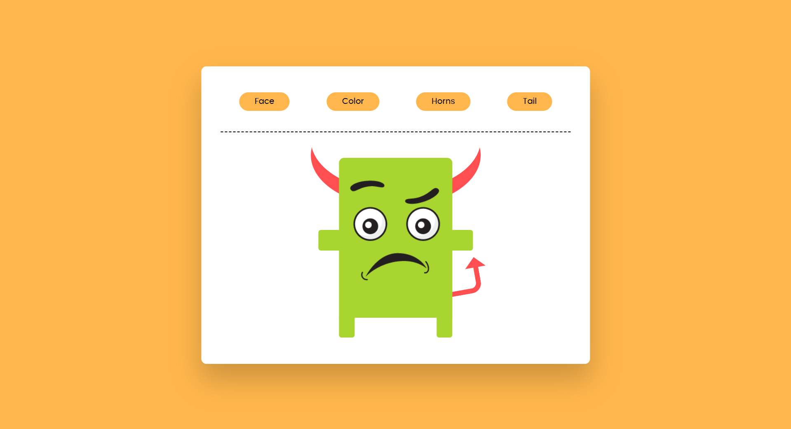

# Character Maker 🎨👾

A simple mini project for practicing **JavaScript**, **HTML**, and **CSS** that allows you to customize a cartoon character’s appearance by clicking buttons.

&nbsp;

## Features

- Change the character’s face using multiple images
- Change the character’s body color
- Change the horns color
- Change the tail color
- Uses CSS Variables for dynamic color changes
- Simple structure, suitable for practicing DOM manipulation and JavaScript events

&nbsp;

## 📸 Preview

 

&nbsp;

## Technologies

- HTML
- CSS (using `:root` and CSS variables)
- Vanilla JavaScript (no frameworks)

&nbsp;

## 📬 Contact

You can reach out or connect with me through the following platforms:  
Feel free to **follow me on LinkedIn**, **message me on Telegram**, or **drop me an email** — I'd love to hear from you!

  
  
  

&nbsp;

## ⭐ Support

If you like this project, consider giving it a ⭐ on GitHub!

&nbsp;

